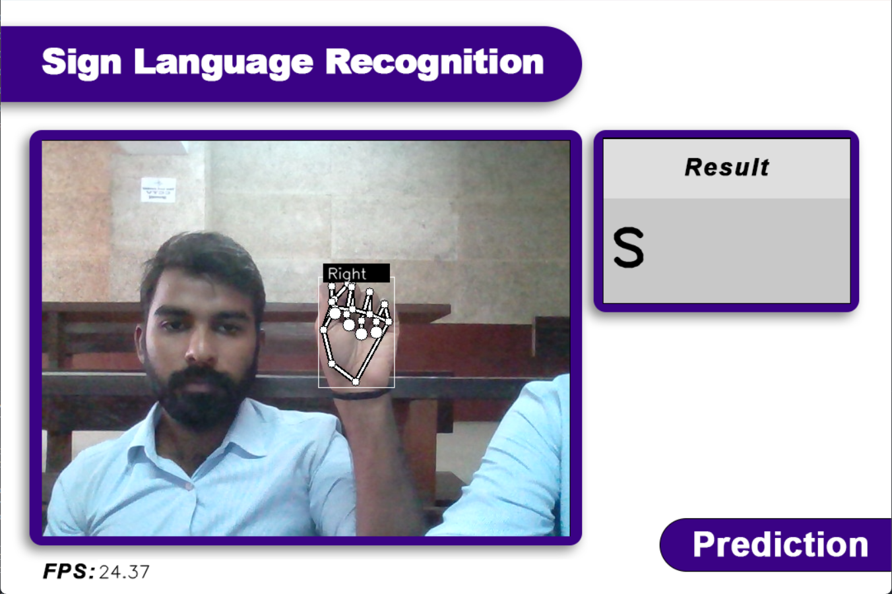

 
# Sign language Recognition 

This repository contains the source code and resources for a Sign Language Recognition System. The goal of this project is to develop a computer vision system that can recognize and interpret sign language gestures in real-time.

Though the project name is `Sign Language Recognition`, it can be used for any hand gesture recognition. In addition, the system is fully customizable and can be trained to recognize any hand gesture.

<!-- ## Table of Contents
### [1. Introduction](##Introduction)
### [2. Installetion](#installetion-1)
### [3. Usage](#usage-1)
### [4. Customization](#customization-1)
### [5. System Overview](#system-overview-1)
### [6. Data Collection](#data-collection-1)
### [7. Preprocessing](#preprocessing-1)
### [8. Model Training](#model-training-1)
### [9. Results](#results-1)
### [10. Contributing](#contributing-1) -->


<br><br>

## Introduction 
Sign language is a visual means of communication used by individuals with hearing impairments. This project aims to bridge the communication gap by developing an automated system that can understand and interpret sign language gestures. The system utilizes computer vision techniques and machine learning algorithms to recognize and translate these gestures into text or speech.

The Sign Language Recognition System consists of several components:

- **Data Collection:** A dataset of sign language gestures is collected, including various hand shapes.

- **Preprocessing:** The collected data is preprocessed to enhance the quality, remove noise, and extract relevant features.

- **Model Training:** Machine learning models, ie. convolutional neural networks (CNNs) is trained on the preprocessed data to learn the mapping between input gestures and their corresponding meanings.

- **Real-time Recognition:** The trained model is deployed in a real-time environment, where it takes video input and performs gesture recognition on the fly.


<br><br>

## Installetion 
To set up the Sign Language Recognition System on your local machine, follow these steps:

1. Clone the repository to your local machine.
   
    ``` bash
    git clone https://github.com/the-sam963/Sign-language-Recognition.git
    ```

2. Install the required packages using the requirements.txt file.

    ``` bash
    # Windows
        cd Sign-language-Recognition
        virtualenv env
        .\env\Scripts\activate.ps1
        pip install -r requirements.txt

    # Linux/ macOS
        cd Sign-language-Recognition
        virtualenv env
        source env/bin/activate
        pip3 install -r requirements.txt
    ```
You are now ready to use the Sign Language Recognition System on your local machine.


<br><br>

## Usage 
To use the Sign Language Recognition System, follow these steps:

1. Ensure that the required dependencies and resources are properly installed and set up.

2. Run the main application
    ``` bash
    python app.py
    ```
3. The application will open a video stream and start recognizing sign language gestures in real-time.

4. Interact with the system by making sign language gestures within the camera's view. The recognized gestures will be displayed on the screen


Here is a demo of the Sign Language Recognition System in action:


<!--  -->


<br><br>

## Customization 
The Sign Language Recognition System is fully customizable and can be trained to recognize any hand gesture. To customize the system, follow these steps:

1. Run the `app.py` file to open the application.
2. Press the `1` key to switch to the `Data Collection` mode. Press the `0` key if you want to switch to the `prediction` mode.
3. Make the hand gesture you want to add to the dataset.
4. Press the alphabate key to save the gesture to the dataset corresponding to the letter.
5. Add as many gestures as you want to the dataset. More data will result in better accuracy.
6. After adding all the gestures, press the `esc` key to quit program. Then run the `train.ipynb` jupyter notebook file to train the model on the new dataset.
   
Enjoy your customized Sign Language Recognition System!

<br><br>

## System Overview 
In order to build such systems, data (keypoints of hands) must be obtained, then features involved in sign making must be extracted and finally combination of features must be analysed to describe the performed sign.


<br><br>

## Data Collection 
The first step in building a sign language recognition system is to collect a dataset of sign language gestures. The dataset is used to train the machine learning model to recognize and interpret these gestures.

For this project we use our hand sign data. And the data is collected using the [MediaPipe](https://google.github.io/mediapipe/) library. The library provides a hand tracking solution that can detect and track 21 hand landmarks in real-time. The hand landmarks are the key points or 2D coordinates that can be used to determine the pose of the hand.


The hand landmarks are used to extract features from the hand gestures. The features are then used to train a machine learning model to recognize and interpret these gestures.


<br><br>

## Preprocessing 
The collected data is preprocessed to enhance the quality, remove noise, and extract relevant features. The preprocessing steps include:

1. Getting the hand landmarks from the video stream.

2. Converting the hand landmarks relative to the `wrist` landmark's coordinate `(0, 0)`. This is done by subtracting the `wrist` landmark's coordinate from all the other landmarks.
 
<d>
    
    
</d>

3. Flatten the normalized hand landmarks to a 1 Dimensional list.

    ```python
    #: Convert into a one-dimensional list
    temp_landmark_list = list(itertools.chain.from_iterable(temp_landmark_list))
    ```


4. Normalizing the hand landmarks from `-1` to `1` value.

    ```python
    # Normalize the hand landmarks to a fixed size
    #: Normalization (-1 to 1)
    max_value = max(list(map(abs, temp_landmark_list)))

    def normalize_(n):
        return n / max_value

    landmark_list = list(map(normalize_, temp_landmark_list))
    ```


5. Adding the normalized hand landmarks to the dataset.

    ```python
    #: Writing dataset
    with open("slr/model/keypoint.csv", 'a', newline="") as f:
        writer = csv.writer(f)
        writer.writerow([index, *landmark_list])
    ```


<br><br>

## Model Training 
The preprocessed data is used to train a machine learning model to recognize and interpret sign language gestures. The model is trained using a convolutional neural network (CNN) architecture. The CNN is trained on the preprocessed data to learn the mapping between input gestures and their corresponding meanings.

1. Obtain or create a sign language dataset.

2. Split the dataset into training and validation sets. It is recommended to use a separate testing set for final evaluation.

3. Choose an appropriate machine learning algorithm or architecture, such as CNNs, RNNs, or their combinations, and implement it using a suitable framework like TensorFlow or PyTorch. For this project, we use a CNN architecture implemented using TensorFlow.

4. Train the model using the training dataset and tune hyperparameters to achieve optimal performance.

5. Validate the model using the validation dataset and make necessary adjustments to improve accuracy and generalization.

6. Test the final model using the testing dataset and evaluate its performance using appropriate metrics.


<br><br>

## Results 
The model was trained on a dataset of 24,000 hand gestures. The dataset was split into training and validation sets with a ratio of 80:20. The model was trained for 100 epochs with a batch size of 180. The training and validation accuracy and loss were recorded for each epoch.

Our Proposed Model achieved an accuracy of `71.12%` on the validation set and `90.60%` on the testing set. The model was able to recognize and interpret sign language gestures in real-time with an accuracy of `71.12%`.


<br><br>

## Contributing
Contributions to this project are welcome. If you encounter any issues or have suggestions for improvements, please open an issue or submit a pull request. Let's work together to make the Sign Language Recognition System even better!

We appreciate your contributions, whether big or small, and we look forward to working together to enhance the Sign Language Recognition System. Let's make a positive impact on the lives of individuals with hearing impairments and promote inclusivity in communication.

